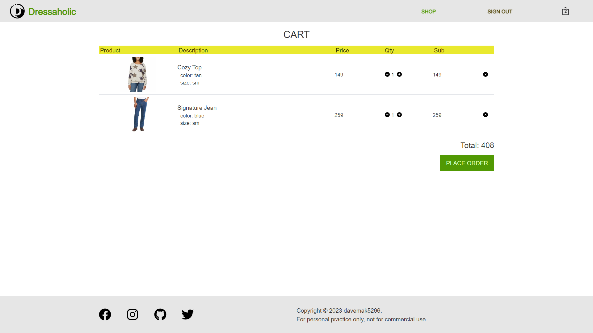

# **Dressaholic-next**
> **Disclaimer**  
This is a personal project created for self-educational purposes only. The project is not intended for commercial use and should not be used for any business purposes. The sample data provided in the project is for demonstration purposes only and should not be used in a production environment.

&nbsp;
## **Introduction**
Dressaholic is a simple e-commerce web application designed for users to browse, filter, and purchase clothing items.  

You can visit the demo site here: {url}

&nbsp;
## **Tech Stak**
This project is built using the following technologies and libraries:
- **HTML & CSS** - The foundation of web apps, with `TailwindCSS` for utility-first styling and responsive design, and `daisy-ui` as component library.
- **TypeScript** - A superset of JavaScript that adds static types, enhancing code quality and maintainability.
- **Next.js** - A React framework for server-rendered applications, providing features like page routing and static site generation.
- **`jotai` & `immer`** - `jotai` uses atoms for global state management, while `immer` simplifies state updates by creating a new immutable state behind the scenes.
- **`framer-motion`** - A library for creating smooth and performant animations and page transitions.
- **Firebase** - A BaaS for user authentication, database management and more.
- **GraphQL** - A query language for APIs, used with `@apollo/server` and `@apollo/client` for efficient data fetching and manipulation.
- **Stripe** - A payment gateway for secure and reliable credit card transactions.

&nbsp;
## **Features**
Dressaholic offers the following features:
1. **User Authentication** - Users can sign in using their existing Google account or register a new account.
2. **Product Filtering** - Users can filter products by brand and price range.
3. **Shopping Cart** - Users can add products to their cart and proceed to place an order by providing customer information.
4. **Payment** - Users can securely pay for their order using a test credit card.
5. **Persistent Cart** - Users' cart items are stored in the database, ensuring that items are not lost upon logout.
6. **Accessibility** - With aria-labels on interactive elements; also users can use keyboard to navigate the site.

&nbsp;
## **Getting Started**
To run this project locally, follow these steps:
1. Clone the repository: `git clone https://github.com/yourusername/dressaholic.git`
2. Install dependencies: `npm install` or `yarn install`
3. Set up environment variables for Firebase and Stripe.
4. Start the development server: `npm run dev` or `yarn dev`
5. Open your browser and navigate to http://localhost:3000

&nbsp;
## **Credits**
- Logo: [flaticon](https://www.flaticon.com/free-icons/letter-d)
- Pictures on HomePage: [Unsplash](https://unsplash.com/)
- Product pictures: [Costco](https://www.costco.com/), [UNIQLO](https://www.uniqlo.com/) & [Decathlon](https://www.decathlon.com/)

&nbsp;
## **Screenshos**

&nbsp;
### **Home page**

&nbsp;
### **Auth page**

&nbsp;
### **Category page for men**

&nbsp;
### **Category page for women**

&nbsp;
### **List of products page**

&nbsp;
### **Product detail page**

&nbsp;
### **Cart page**

&nbsp;
### **Order page**
